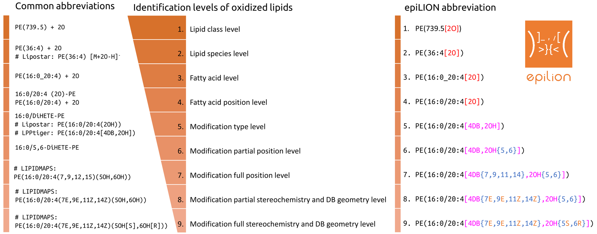
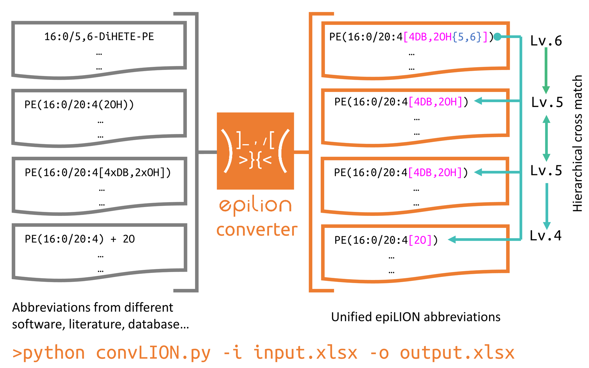
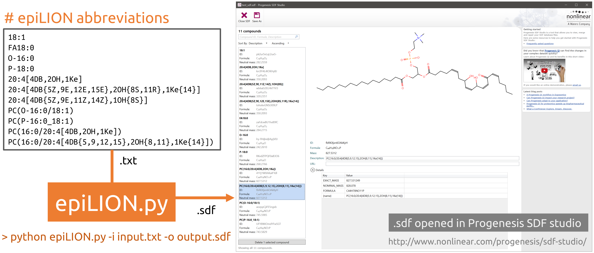
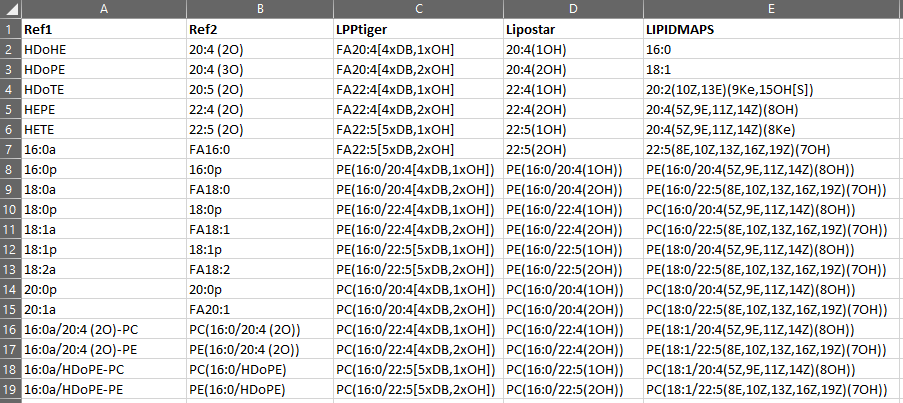
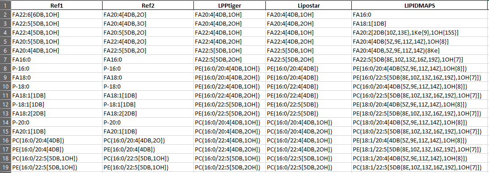

# 

## Lipid abbreviations linked by unified nomenclature

The LipidLynx project is aimed to provide a unified identifier for major lipids, especially oxidized lipids
in the epilipidome.

-   Main Features

    -   Optimized for manual interpretation and computer processing
    -   Unified modification controlled vocabularies
    -   Unified position specific annotations
    -   Special optimization for prostane containing lipids
    -   Suitable for head group modified phospholipids
    -   Hierarchical abbreviation system
    -   Capable to parse fuzzy site unspecific annotations

-   LipidLynx abbreviation converter

    -   Convert different abbreviations to uniformed LipidLynx abbreviations

-   LipidLynx structure and MS property generator

    -   Abbreviation to SMILES/ MOL / SDF conversion using python

-   Currently supported modifications

    -   `DB`: C=C bond
    -   `OH`: hydroxy
    -   `Hp`: hydroperoxy
    -   `NH2`: amino
    -   `Me`: methyl
    -   `Ke`: keto/oxo
    -   `Ep`: epoxy
    -   `SH`: thio
    -   `My`: methylene
    -   `Br`: bromo
    -   `Cl`: chloro
    -   `F`: fluoro
    -   `CN`: cyano

-   Example of LipidLynx abbreviations

    -   Fatty acids

        -   FA18:0
        -   O-16:0
        -   P-18:0
        -   20:4\[4DB,2OH,1Ke]
        -   20:4\[4DB{5Z,9E,11Z,14Z},1OH{8S}]
        -   20:4\[4DB{5Z,9E,12E,15E},2OH{8S,11R},1Ke{14}]

    -   Phospholipids
        -   PC(O-16:0/18:1)
        -   PC(P-16:0_18:1)
        -   PC(16:0/20:4\[4DB,2OH,1Ke])
        -   PC(16:0/20:4\[4DB{5,9,12,15},2OH{8,11},1Ke{14}])

## Instructions

### How to install LipidLynx from source code

-   Download the source code as zip file for your system

    -   Download LipidLynx source Code as .zip. Please notice the date and version of LipidHunter source code.

    -   Professional users can use `git` to clone the whole repository, please make sure that you switched to the correct branch.

    -   Only the released version is recommended for real data processing. Other development branches may lead to unknown issues and miss interpretation of the data.

-   Rename the downloaded file to `LipidLynx.zip`

-   Unzip `LipidLynx.zip` file to any folder.

-   Install LipidLynx source code

    -   LipidLynx is developed under python 3.6+.

    -   The best way is to use virtual environment such as `conda`

    -   Main dependencies are:

        -   Data processing: `pandas`

        -   SDF generation: `rdkit`

    -   Test source code installation

        -   LipidLynx is configured to use [travis-ci](https://travis-ci.com) with `py.test` to test on Windows, Linux, and macOS.

        -   [Current status of the master branch ](https://travis-ci.com/SysMedOs/LipidLynx/branches)

        -   you can also use py.test to test LipidLynx in your python environment

            -   unit test for LipidLynx converter is provided in [`Test/test_convLION.py`](test/test_convLynx.py)

            -   unit test for LipidLynx generator is provided in [`Test/test_LipidLynx.py`](test/test_LipidLynx.py)

-   Run LipidLynx converter

    -   Run `python convLION.py -i Test/TestInput/test_crosscheck.xlsx -o Test/TestOutput/test_crosscheck_output.xlsx`

    -   convLION read list of different abbreviations in the `test_crosscheck.xlsx`
        and generate the converted LipidLynx abbreviations in the output file.

    -   convLION can read an write both `.xlsx` and `.csv` file.

    -   sample input

        

    -   sample output

        

-   Run LipidLynx generator

    -   Run `python LipidLynx.py -i Test/TestInput/test_names.txt -o Test/TestOutput/test_sdf.sdf`

    -   LipidLynx read list of LipidLynx abbreviations in the `test_names.txt`
        and generate the structure in a combined sdf file.

-   SDF output

    -   The sdf file is generated by using `rdkit` <https://www.rdkit.org>

    -   The sdf output can be used by:

        -   Progenesis SDF studio, free for academic use:
            <http://www.nonlinear.com/progenesis/sdf-studio/>

        -   ChemAxon Instant Jchem, academic license available:
            <https://chemaxon.com/products/instant-jchem>

-   Errors/bugs

      In case you experienced any problems with running LipidHunter

      please report an issue in the [issue tracker](https://github.com/SysMedOs/LipidLynx/issues) or contact us.

### License

-   LipidHunter is Dual-licensed

    -   For academic and non-commercial use: `GPLv2 License`:

        -   [The GNU General Public License version 2](https://www.gnu.org/licenses/old-licenses/gpl-2.0.en.html)

    -   For commercial use: please contact the develop team by email.

-   Please cite our publication in an appropriate form.

    -   Ni, Zhixu, Laura Goracci, Gabriele Cruciani, and Maria Fedorova.
        "Computational solutions in redox lipidomics–Current strategies and future perspectives."
        Free Radical Biology and Medicine (2019).
            \- DOI: [10.1016/j.freeradbiomed.2019.04.027](https://www.sciencedirect.com/science/article/pii/S0891584919303466)

### Report issues

-   Report any issues here: <https://github.com/SysMedOs/LipidLynx/issues>

### Fundings

We acknowledge all projects that supports the development of LipidHunter:

-   BMBF - Federal Ministry of Education and Research Germany:

    <https://www.bmbf.de/en/>

-   e:Med Systems Medicine Network:

    <http://www.sys-med.de/en/>

-   SysMedOS Project :

    <https://home.uni-leipzig.de/fedorova/sysmedos/>
