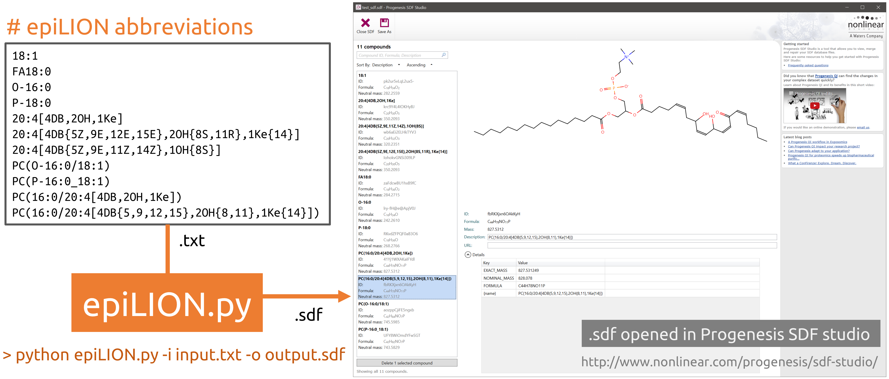

# About epiLION #
# # epiLipidome Identifier Optimized Nomenclature #

The epiLION project is aimed to provide a unified identifier for major lipids, especially oxidized lipids
in the epilipidome.

* Main Features

    + Optimized for manual interpretation and computer processing
    + Unified modification controlled vocabularies
    + Unified position specific annotations
    + Special optimization for prostane containing lipids
    + Suitable for head group modified phospholipids
    + Hierarchical abbreviation system  
    + Abbreviation to SMILES/ MOL / SDF conversion using python
    + Capable to parse fuzzy site unspecific annotations

* Currently supported modifications

    + `DB`: C=C bond
    + `OH`: hydroxy
    + `Hp`: hydroperoxy
    + `NH2`: amino
    + `Me`: methyl
    + `Ke`: keto/oxo
    + `Ep`: epoxy
    + `SH`: thio
    + `My`: methylene
    + `Br`: bromo
    + `Cl`: chloro
    + `F`: fluoro
    + `CN`: cyano

* Example of epiLION abbreviations
    
    + Fatty acids
        - FA18:0
        - O-16:0
        - P-18:0
        - 20:4[4DB,2OH,1Ke]
        - 20:4[4DB{5Z,9E,11Z,14Z},1OH{8S}]
        - 20:4[4DB{5Z,9E,12E,15E},2OH{8S,11R},1Ke{14}]
    + Phospholipids
        - PC(O-16:0/18:1)
        - PC(P-16:0_18:1)
        - PC(16:0/20:4[4DB,2OH,1Ke])
        - PC(16:0/20:4[4DB{5,9,12,15},2OH{8,11},1Ke{14}]) 

## Instructions ##

### How to install epiLION from source code ###
* Download the source code as zip file for your system
    + Download epiLION source Code as .zip. Please notice the date and version of LipidHunter source code.
    + Professional users can use `git` to clone the whole repository, please make sure that you switched to the correct branch.
    + Only the released version is recommended for real data processing. Other development branches may lead to unknown issues and miss interpretation of the data.

* Rename the downloaded file to `epiLION.zip`
* Unzip `epiLION.zip` file to any folder.

* Python environment

    + epiLION is developed under python 3.6+.
    + The best way is to use virtual environment such as `conda`
    + Main dependencies are:
        - Data processing: `pandas`
        - SDF generation: `rdkit`
    + Test source code installation
        - Run `python epiLION.py -i Test/TestInput/test_names.txt -o Test/TestOutput/test_sdf.sdf` 
        - epiLION read list of epiLION abbreviations in the `test_names.txt` 
        and generate the structure in a combined sdf file.
        - unit test is provided in [`Test/test_epiLION.py`](Test/test_epiLION.py)
    
* SDF output

    + The sdf file is generated by using `rdkit` [https://www.rdkit.org](https://www.rdkit.org)
    + The sdf output can be used by:
        - Progenesis SDF studio, free for academic use:
        [http://www.nonlinear.com/progenesis/sdf-studio/](http://www.nonlinear.com/progenesis/sdf-studio/)
        - ChemAxon Instant Jchem, academic license available: 
        [https://chemaxon.com/products/instant-jchem](https://chemaxon.com/products/instant-jchem)
        
* Errors/bugs
  
    In case you experienced any problems with running LipidHunter
    
    please report an issue in the [issue tracker](https://github.com/SysMedOs/epiLION/issues) or contact us.

### License ###

+ LipidHunter is Dual-licensed
    * For academic and non-commercial use: `GPLv2 License`: 
    
        [The GNU General Public License version 2](https://www.gnu.org/licenses/old-licenses/gpl-2.0.en.html)

    * For commercial use: please contact the develop team by email.

### Further questions? ###

* Report any issues here: [https://github.com/SysMedOs/epiLION/issues](https://github.com/SysMedOs/epiLION/issues)

### Fundings ###
We acknowledge all projects that supports the development of LipidHunter:

+ BMBF - Federal Ministry of Education and Research Germany:

    https://www.bmbf.de/en/

+ e:Med Systems Medicine Network:

    http://www.sys-med.de/en/

+ SysMedOS Project : 

    https://home.uni-leipzig.de/fedorova/sysmedos/
