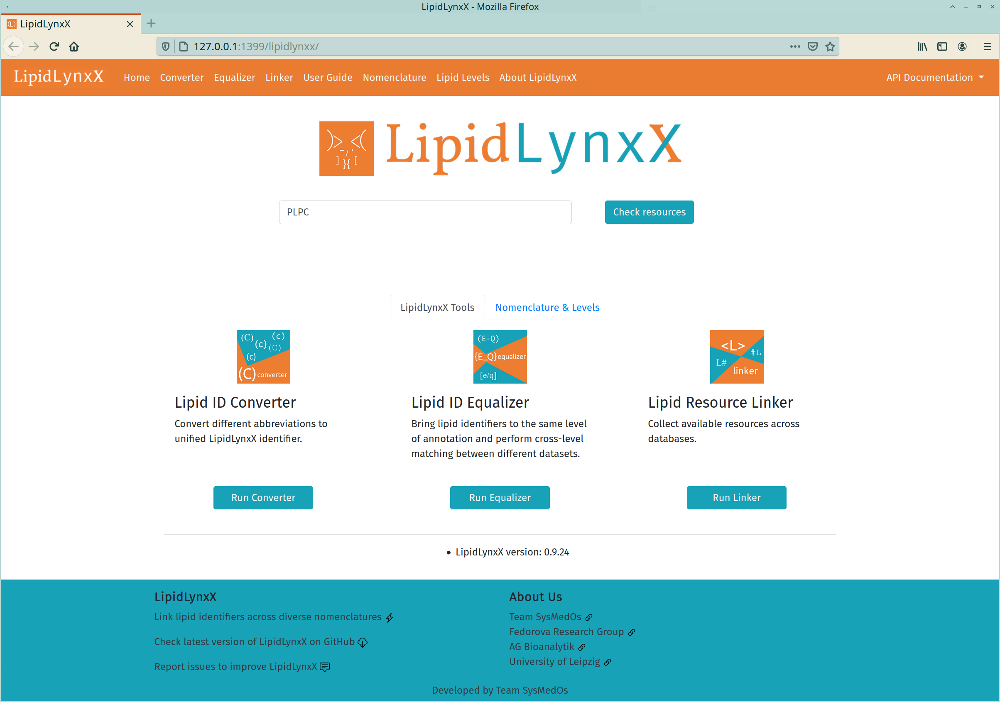
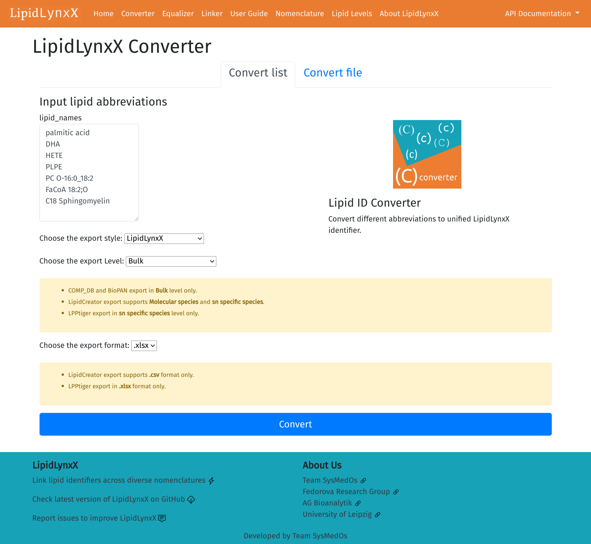
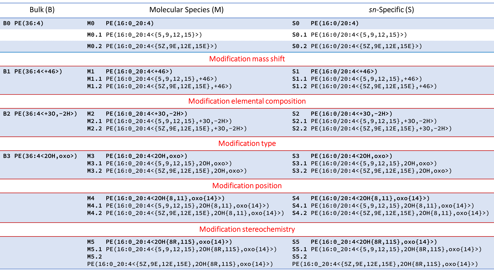

 


The LipidLynxX project is aimed to provide a unified identifier for major lipids, especially oxidized lipids
in the epilipidome.

### latest release: [v0.9.24](https://github.com/SysMedOs/LipidLynxX/releases)




## Main Modules

- **LipidLynxX Converter**

  - Convert different abbreviations to uniformed LipidLynxX ID

- **LipidLynxX Equalizer**

  - Cross compare different level of LipidLynxX ID on selected level

- **LipidLynxX Linker**

  - Link lipid abbreviations to available resources

## Key Features

- Optimized for manual interpretation and computer processing
- Suitable for both unmodified lipids and modified lipids
- Unified modification controlled vocabularies
- Unified position specific annotations
- Cross level match based on shared levels
- Extract key information from LipidLynxX ID
- Strictly controlled format using JSON schema
- Easy to use Graphic User Interface
- API access for professional users
- Command line tools for professional users

### Supported lipid notation styles

The current LipidLynxX source code was tested using our collection of lipid abbreviations
for major lipid classes from following databases and programs:

- Databases (5):
  - `HMDB`, `LIPID MAPS LMSD & COMP_DB`, `LipidHome`, `RefMet`, `SwissLipids`

- Programs (17):

  - `ALEX123 lipid calculator`, `Greazy`, `LDA 2`, `LipidBlast`, `LipidCreator`, `LipiDex`, `LipidFrag`, `LipidHunter`,
      `LipidMatch`, `LipidPro`, `LipidSearch`, `Lipostar`, `LIQUID`, `LPPtiger`, `MetFrag`, `MS-DIAL`, `MZmine2`
- Shorthand Notations
  - Shorthand notation using space: e.g. PC 16:0_18:2
  - Shorthand notation derivatives using brackets: e.g. PC(16:0_18:2)
- Common abbreviations (customizable):
  -  Abbreviations such as DHA, PAPE, PLPC, PONPC .etc are also included as `defined alias`.
  detailed settings can be found in `lynx/configurations/defined_alias.json`

## Important Notice

**If your database / program is not included in the list above**, you can test if any of the configuration files located in `lynx/configurations/rules/input` would fit to your database / program.
If conversion is not possible, please contact us so that we can help you to generate suitable configuration file.

A robust and accurate converter can only be achieved by community-wide collaborations, thus any issue reports from general users and developers are welcome and will improve LipidLynxX project.

Thus, if you meet any issues during using LipidLynxX, please [report your issue
here](https://github.com/SysMedOs/LipidLynxX/issues)

### Notice to general users

An easy to use .exe version for Windows platform users is available for test purpose only.
- Download [LipidLynxX_v0-9-24.zip ~125MB](https://github.com/SysMedOs/LipidLynxX/releases/download/v0.9.24/LipidLynxX_v0-9-24.zip)
- Unzip it to a folder
- Find the `LipidLynxX.exe` and double click
- LipidLynxX backend will pop-up a webpage in your default web browser e.g. Chrome, and a command line window for debug information.
- Please allow LipidLynxX to pass firewall for the Linker module to access databases
- Just close the command line debug window to quit LipidLynxX
- Due to limitations of packaging, please run max 3 tasks at the same time.
- Known issues: if Linker runs more than 300s or more than 30s/per ID, please restart LipidLynxX and try again. 

### Additional notice to developers

Since the code is still changing rapidly, the definitions of API and documentations in the source code may not be updated accordingly.
We kindly ask if you have any plans to use LipidLynxX API contact us first, or follow this repository to get timely notifications when new changes are introduced.

New features of LipidLynxX is generally developed using repository [https://github.com/ZhixuNi/LipidLynxX](https://github.com/ZhixuNi/LipidLynxX).

- Please use python 3.8.5 and run from source code.
- Recommend to use "pip install -r requirements.txt" in an virtual env to install the dependencies
- run `python LipidLynxX.py` to start.
- please check `lib\lynx\config.ini` for more settings of ports and max clients/workers


## Instructions

### Sample files:

- Test input file: `LipidLynxX/doc/sample_data/input`
- Test output file: `LipidLynxX/doc/sample_data/output`

### How to install and use LipidLynxX

Please find our user guide in folder `doc`.
-  [User Guide in PDF format](doc/LipidLynxX_UserGuide.pdf)
-  [User Guide in Markdown format](doc/LipidLynxX_UserGuide.md)

## Try LipidLynxX simple converter demo on [`mybinder.org`](https://mybinder.org)

**This demo is always updated automatically to the latest source code on the master branch.**
To preview the latest changes on the converter without dealing with source code.

Just click this button 👉
[](https://mybinder.org/v2/gh/ZhixuNi/LipidLynxX/develop?filepath=converter_notebook.ipynb)

And wait a bit ☕ Binder and Jupyter Notebook will prepare LipidLynxX demo for you.

- You can paste a list of lipid abbreviations, select export style, and download the output table as `.csv` or `.xlsx`.

- If you observed some IDs not converted in the Windows .exe version, try this demo to see if it got fixed.

- You can run the notebook named `converter_notebook.ipynb` in this repository as well.


### Screenshots

- **GUI**
    
- **API**
    - LipidLynxX provides API documentation using both OpenAI (left) and ReDoc (right)
    
    
    
- **Terminal Tools**
    
    - LipidLynxX provide the same function in command line.
        ```bash
            python cli-lynx.py
        ```
        

- **Use as Python module**
    - Please check `examples_notebook.ipynb`
    - You can find online interactive version via Binder 
   [](https://mybinder.org/v2/gh/ZhixuNi/LipidLynxX/develop?filepath=converter_notebook.ipynb)

### LipidLynxX Nomenclature

- LipidLynxX levels

  - Lipid level:
    - **B**: Bulk
    - **M**: Molecular species
    - **S**: sn Specific
    
  - Modification levels:

    - 0 : no modification
    - 1 : mass shift
    - 2 : element shift
    - 3 : number and type of modification
    - 4 : modification position information
    - 5 : additional information (e.g. R-/S-)

  - Double bond levels:

    - .0 : no information of double bond position (.0 should always be skipped, e.g. B0.0 -> B0)
    - .1 : double bond position information given
    - .2 : cis- / trans- information of all C=C bond

- LipidLynxX level matrix

  - The combinations of 3 sub-levels result in a matrix of LipidLynxX levels
    - e.g. B2 , D4, and S4.2

    | Mod  | DB   |      | Bulk   | Molecular species |          |          | sn Specific |          |          |
    | ---- | ---- | ---- | ------ | -------- | -------- | -------- | ----------- | -------- | -------- |
    | 0    |      |      | **B**  | **M**    |          |          | **S**       |          |          |
    |      | .1   |      |        |          | **M0.1** |          |             | **S0.1** |          |
    |      |      | .2   |        |          |          | **M0.2** |             |          | **S0.2** |
    | 1.   |      |      | **B1** | **M1**   |          |          | **S1**      |          |          |
    |      | .1   |      |        |          | **M1.1** |          |             | **S1.1** |          |
    |      |      | .2   |        |          |          | **M1.2** |             |          | **S1.2** |
    | 2.   |      |      | **B2** | **M2**   |          |          | **S2**      |          |          |
    |      | .1   |      |        |          | **M2.1** |          |             | **S2.1** |          |
    |      |      | .2   |        |          |          | **M2.2** |             |          | **S2.2** |
    | 3.   |      |      | **B3** | **M3**   |          |          | **S3**      |          |          |
    |      | .1   |      |        |          | **M3.1** |          |             | **S3.1** |          |
    |      |      | .2   |        |          |          | **M3.2** |             |          | **S3.2** |
    | 4.   |      |      |        | **M4**   |          |          | **S4**      |          |          |
    |      | .1   |      |        |          | **M4.1** |          |             | **S4.1** |          |
    |      |      | .2   |        |          |          | **M4.2** |             |          | **S4.2** |
    | 5.   |      |      |        | **M5**   |          |          | **S5**      |          |          |
    |      | .1   |      |        |          | **M5.1** |          |             | **S5.1** |          |
    |      |      | .2   |        |          |          | **M5.2** |             |          | **S5.2** |

  - Example

    

- Currently supported modification controlled vocabularies
    

- Some examples of LipidLynx abbreviations:

  - Fatty acids

    - FA18:0
    - O-16:0
    - P-18:0
    - 20:4<2OH,oxo>
    - 20:4{5Z,9E,11Z,14Z}<OH{8S}>
    - 20:4{5Z,9E,12E,15E}<2OH{8S,11R},oxo{14}>

  - Phospholipids
  
    - PC(O-16:0/18:1)
    - PE(P-16:0_18:1)
    - PC(16:0/20:4<2OH,oxo>)
    - PE(16:0/20:4{5,9,12,15}<2OH{8,11},oxo{14}>)

### Information for developers

- LipidLynxX is configured to use [travis-ci](https://travis-ci.com) and GitHub Actions with `py.test` to test
cross-platform compatibility on Linux, macOS and  Windows.

- Current status of the master branch 

    [](https://github.com/psf/black)
    [](https://app.codacy.com/gh/SysMedOs/LipidLynxX?utm_source=github.com&utm_medium=referral&utm_content=SysMedOs/LipidLynxX&utm_campaign=Badge_Grade_Dashboard) 
    
    
    [](https://travis-ci.com/SysMedOs/LipidLynxX)
    
    
- You can also use py.test to test LipidLynxX in your python environment, all test files can be found in `./test` folder.

### Errors/bugs

In case you experienced any problems with running LipidLynxX, 
please report an issue in the [issue tracker](https://github.com/SysMedOs/LipidLynxX/issues) or contact us.

### Report issues

- Report any issues here: <https://github.com/SysMedOs/LipidLynxX/issues>

### License

- LipidLynxX is using GPL V3 License
 
  - [](https://www.gnu.org/licenses/gpl-3.0)

- Please cite our publication in an appropriate form.

  - LipidLynxX preprint on `bioRxiv.org`

    - Zhixu Ni, Maria Fedorova.
        "LipidLynxX: a data transfer hub to support integration of large scale lipidomics datasets"

      - DOI: [10.1101/2020.04.09.033894](https://www.biorxiv.org/content/10.1101/2020.04.09.033894v1)

### Dependencies
- LipidLynxX is powered by open-source projects, main dependencies are:

    - `FastAPI`, `starlette`, `Typer`, and `uvicorn`
    
    - `jsonschema`, `pandas`, and `regex`
    
- LipidLynxX is based on the previous project [epiLION](https://github.com/SysMedOs/epiLION)

    - Ni, Zhixu, Laura Goracci, Gabriele Cruciani, and Maria Fedorova.
        "Computational solutions in redox lipidomics–Current strategies and future perspectives."
        Free Radical Biology and Medicine (2019).
      - DOI: [10.1016/j.freeradbiomed.2019.04.027](https://www.sciencedirect.com/science/article/pii/S0891584919303466)

### Fundings

We acknowledge all projects that supports the development of LipidLynxX:

- BMBF - Federal Ministry of Education and Research Germany:

    <https://www.bmbf.de/en/>

- e:Med Systems Medicine Network:

    <http://www.sys-med.de/en/>

- SysMedOS Project :

    <https://home.uni-leipzig.de/fedorova/sysmedos/>
