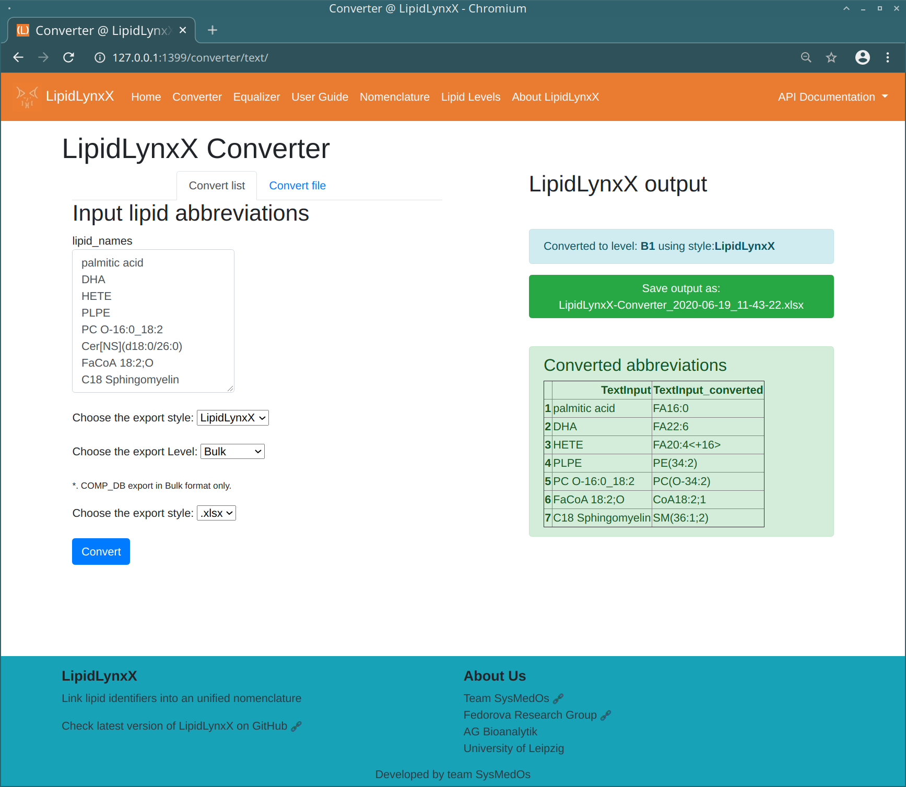

# LipidLynxX  

The LipidLynxX project is aimed to provide a unified identifier for major lipids, especially oxidized lipids
in the epilipidome.

### Key Features

-   Optimized for manual interpretation and computer processing
-   Suitable for both unmodified lipids and modified lipids
-   Unified modification controlled vocabularies
-   Unified position specific annotations
-   Cross level match based on shared levels
-   Extract key information from LipidLynxX ID
-   Strictly controlled format using JSON schema
-   Easy to use Graphic User Interface
-   API access for professional users

 

### Main Modules

-   **LipidLynxX Converter**

    -   Convert different abbreviations to uniformed LipidLynxX ID
    
-   **LipidLynxX Equalizer**

    -   Cross link different level of LipidLynxX ID on selected level
    
### LipidLynxX Nomenclature

-   LipidLynxX levels
    
    -   Lipid level: 
        -   **B**: Bulk
        -   **D**: Discrete
        -   **S**: sn Specific
    -   Modification levels:
    
        -   0 : no modification
        -   1 : mass shift
        -   2 : element shift
        -   3 : number and type of modification
        -   4 : modification position information
        -   5 : additional information (e.g. R-/S-)
        
    -   Double bond levels:
        
        -   .0 : no information of double bond position (.0 should always be skipped, e.g. B0.0 -> B0)
        -   .1 : double bond position information given
        -   .2 : cis- / trans- information of all C=C bond 

-   LipidLynxX level matrix
    
    - The combinations of 3 sub-levels result in a matrix of LipidLynxX levels
        - e.g. B2 , D4, and S4.2

    |Mod|DB| |Bulk|Discrete| | |sn Specific| | |
    |---|---|---|---|---|---|---|---|---|---|
    |0 |   | |**B**|**D**| | |**S**| | |
    |   |.1| | | |**D0.1**| | |**S0.1**| |
    |   | |.2| | | |**D0.2**| | |**S0.2**|
    |1.| | |**B1**|**D1**| | |**S1**| | |
    |   |.1| | | |**D1.1**| | |**S1.1**| |
    |   | |.2| | | |**D1.2**| | |**S1.2**|
    |2.| | |**B2**|**D2**| | |**S2**| | |
    |   |.1| | | |**D2.1**| | |**S2.1**| |
    |   | |.2| | | |**D2.2**| | |**S2.2**|
    |3.| | |**B3**|**D3**| | |**S3**| | |
    |   |.1| | | |**D3.1**| | |**S3.1**| |
    |   | |.2| | | |**D3.2**| | |**S3.2**|
    |4.| | | |**D4**| | |**S4**| | |
    |   |.1| | | |**D4.1**| | |**S4.1**| |
    |   | |.2| | | |**D4.2**| | |**S4.2**|
    |5.| | | |**D5**| | |**S5**| | |
    |   |.1| | | |**D5.1**| | |**S5.1**| |
    |   | |.2| | | |**D5.2**| | |**S5.2**|

    - Example
    
    

-   Currently supported modification controlled vocabularies
    

    

-   Example of LipidLynx abbreviations for Major lipid classes

    -   Fatty acids

        -   FA18:0
        -   O-16:0
        -   P-18:0
        -   20:4\<2OH,oxo>
        -   20:4\<{5Z,9E,11Z,14Z},OH{8S}>
        -   20:4\<{5Z,9E,12E,15E},2OH{8S,11R},oxo{14}>

    -   Phospholipids
        -   PC(O-16:0/18:1)
        -   PE(P-16:0_18:1)
        -   PC(16:0/20:4\<2OH,oxo>)
        -   PE(16:0/20:4\<{5,9,12,15},2OH{8,11},oxo{14}>)

## Instructions

### How to install LipidLynxX from source code

-   Download the source code as zip file for your system

    -   Download LipidLynxX source Code as .zip. Please notice the date and version of LipidHunter source code.

    -   Professional users can use `git` to clone the whole repository, please make sure that you switched to the correct branch.

    -   Only the released version is recommended for real data processing. Other development branches may lead to unknown issues and miss interpretation of the data.

-   Rename the downloaded file to `LipidLynxX.zip`

-   Unzip `LipidLynxX.zip` file to any folder.

-   Install LipidLynxX source code

    -   LipidLynxX is developed under python 3.7+.

    -   The best way is to use virtual environment such as `conda`

    -   Main dependencies are:

        -   Data processing:

            -   `jsonschema`, `natsort`, `pandas`, `openpyxl`, `xlrd`, `xlwt`
            
        -    UI and webservice:
            -   `flask`, `requests`, `wtforms`, `werkzeug`, `zerorpc`
        
-   Test source code installation
    
    -   LipidLynxX is configured to use [travis-ci](https://travis-ci.com) with `py.test` to test on Windows, Linux, and macOS.
    
    -   [Current status of the master branch ](https://travis-ci.com/SysMedOs/LipidLynxX/branches)
    
    -   You can also use py.test to test LipidLynxX in your python environment, all test files can be found in `./test` folder.
    
-   Errors/bugs

      In case you experienced any problems with running LipidHunter

      please report an issue in the [issue tracker](https://github.com/SysMedOs/LipidLynxX/issues) or contact us.

### Screenshots
-   **GUI**
     
-   **API**
     

### License

-   LipidLynxX is Dual-licensed

    -   For academic and non-commercial use: `GPLv2 License`:

        -   [The GNU General Public License version 2](https://www.gnu.org/licenses/old-licenses/gpl-2.0.en.html)

    -   For commercial use: please contact the develop team by email.

-   Please cite our publication in an appropriate form.
    
    - LipidLynxX preprint on `bioRxiv.org`
      
        -   Zhixu Ni, Maria Fedorova.
        "LipidLynxX: lipid annotations converter for large scale lipidomics and epilipidomics datasets"
            
            - DOI: [10.1101/2020.04.09.033894](https://www.biorxiv.org/content/10.1101/2020.04.09.033894v1)

    -   LipidLynx is based on the previous project [epiLION](https://github.com/SysMedOs/epiLION)
    
        -   Ni, Zhixu, Laura Goracci, Gabriele Cruciani, and Maria Fedorova.
        "Computational solutions in redox lipidomics–Current strategies and future perspectives."
        Free Radical Biology and Medicine (2019).
            - DOI: [10.1016/j.freeradbiomed.2019.04.027](https://www.sciencedirect.com/science/article/pii/S0891584919303466)

### Report issues

-   Report any issues here: <https://github.com/SysMedOs/LipidLynxX/issues>

### Fundings

We acknowledge all projects that supports the development of LipidHunter:

-   BMBF - Federal Ministry of Education and Research Germany:

    <https://www.bmbf.de/en/>

-   e:Med Systems Medicine Network:

    <http://www.sys-med.de/en/>

-   SysMedOS Project :

    <https://home.uni-leipzig.de/fedorova/sysmedos/>
