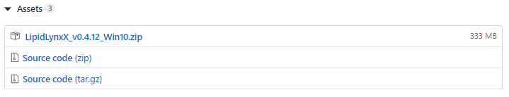

 

# LipidLynxX User Guide


## This user guide is designed for:

-   LipidLynxX version: v0.4.12
-   API version: v0.1

## Table of Contents
1. [How to install](#How_to_install_LipidLynxX)
    - 1.1. [Install from exe version for Windows 10](##Install_from_exe_version_for_Windows_10)
    - 1.2. [Install from source code](##Install_from_source_code)
2. [Step by step tutorial](#Step_by_step_tutorial)
    - 2.1. [Test files](##Test_files)
    - 2.2. [How to use LipidLynxX Converter](##How_to_use_LipidLynxX_Converter)
    - 2.3. [How to use LipidLynxX Equalizer](##How_to_use_LipidLynxX_Equalizer)

## How to install LipidLynxX

### Install from exe version for Windows 10

Please get the latest version from LipidLynxX repository on GitHub using the link below:

https://github.com/SysMedOs/LipidLynxX/releases

In each release, there is always an `Assets` section. Please download the Windows version in `.zip` format (usually around 350 MB).



When the file is successfully downloaded, you can unzip it to any folder .e.g `D:/Apps/LipidLynxX`.
Open the folder of LipidLynxX and you can find the `LipidLynxX.exe` by using `right click -> Group by -> Type`

You can double click on `LipidLynxX.exe` to start LipidLynxX

Your antivirus may block it first and shows a blue frame. 
After virus checking finished, it may have some error message. Close all warnings and this command prompt window.

Now click on `LipidLynxX.exe` again and the following command prompt window will show up without any error message.

A web browser window will start automatically and load the LipidLynxX local web service at:
[http://127.0.0.1:5000/lynx/](http://127.0.0.1:5000/lynx/)
Please make sure you have Chrome or Firefox installed.

If windows internet explorer or Microsoft Edge browser started by default, 
please start Chrome or Firefox manually and visit [http://127.0.0.1:5000/lynx/](http://127.0.0.1:5000/lynx/)

Now you have LipidLynxX installed successfully.

Please leave the LipidLynxX command prompt window on during the run. 
If you accidentally close the web page of LipidLynxX, you can always visit 
[http://127.0.0.1:5000/lynx/](http://127.0.0.1:5000/lynx/) to get back to LipidLynxX.

If you want to quit LipidLynxX, just close the LipidLynxX command prompt window, 
and then the LipidLynxX at [http://127.0.0.1:5000/lynx/](http://127.0.0.1:5000/lynx/) will be switched off.
Please make sure you saved all your output files before closing the LipidLynxX command prompt window.

### Install from source code
Please make sure you have `git` installed.

You can use python 3.7.6 directly, using virtual environment is strongly recommenced.
In this tutorial, `conda` from `anaconda` or `miniconda` is used. 
Please find the installation guide of conda for your system on the following link:
[https://docs.anaconda.com/anaconda/install/](https://docs.anaconda.com/anaconda/install/)

Following commands can be used on platforms including Linux, macOS, and Windows 10.
The screenshots are mainly taken on Ubuntu Linux 18.04 LTS with zsh, however, it may have different style of
terminal window display on your system, but the commands and the main output should stay the same cross platforms.

After successful installation of `git` and `conda`, you can clone the LipidLynxX source code to your disk.
e.g. on Ubuntu Linux 18.04 LTS with zsh: 
```bash
git clone --depth=50 --branch=master https://github.com/SysMedOs/LipidLynxX.git LipidLynxX
```

Now you can create a virtual environment for LipidLynxX.
For Windows users, please use the `Anaconda Prompt` instead of `Commandline Pront` or `Power Shell`
here a virtual environment named `envlynx` is created.
You might have to type `y` for `enter` to confirm the creation of this virtual environment.
```bash
conda create -n envlynx python=3.7
```
e.g. on Ubuntu Linux 18.04 LTS with zsh:


For Windows users:


You can then activate the virtual environment created above. 
Notice that the indicator of your python environment will be changed from `anconda`, `base`, or `miniconda` 
to the name of the virtual environment created above (`envlynx`).
e.g. on Ubuntu Linux 18.04 LTS with zsh:


on Windows 10 using Anaconda Prompt


Now you can navigate to LipidLynxX source code folder and install required packages using file `requirements.txt`.
```bash
cd LipidLynxX
pip install -r requirements.txt
```
You might have to type `y` for `enter` to confirm the installation of a list of packages.


Wait until you see the notification message that a list of packages has been successfully installed.  


Then you can start LipidLynxX using following command:

```bash
python LipidLynxX.py
```


After some debug information, you will see following information:


And a browser window will pop up with LipidLynxX interface using link:

[http://127.0.0.1:5000/lynx/](http://127.0.0.1:5000/lynx/)


## Step by step tutorial

LidpidLynxX currently have two major modules:
- LipidLynxX Converter
    - Convert different annotations to uniform LipidLynxX ID
- LipidLynxX Equalizer
    -  Bring lipid identifiers to the same level of annotation and perform cross-level matching between different dataset

### Test files:
-  Test input file: `doc/sample_data/input`
-  Test output example files: `doc/sample_data/output`


### How to use LipidLynxX Converter

For Conversion, type/paste your lipid annotations or choose your .xlsx or .csv files. Press “convert
abbreviations” or “convert table”, wait for results. You will see the output on the right-hand side
or just download the table with converted IDs.

#### Convert by text input
-  Paste list of abbreviations in the text input field and press “convert abbreviations”.

    -   You can find example input in file `doc/sample_data/input/LipidLynxX_conveter_test.txt`
   
   

-  You will see the output on the right-hand side or just download the table with converted IDs.

   -   You can find example output `doc/sample_data/output/LipidLynxX-Converter_from_text.xlsx`
   
   

#### Convert by table input
-   Press "Choose file"

    
    
-   Select the input file in .xlsx or .csv format and press “Convert table”

    -   You can use example file `doc/sample_data/input/LipidLynxX_test.xlsx`
    
    
    
-   You will see the output on the right-hand side or just download the table with converted IDs.

    -   You can find example output `doc/sample_data/output/LipidLynxX-Converter_from_table.xlsx`
    
    


### How to use LipidLynxX Equalizer

To Equalize, select LipidLynxX Equalizer tab from Home page. Select the level of annotations to which you would
like to cross-match your lipid annotations (you can select more than one). For details on annotation levels see
the tables on the right hand-side. Choose you datafile and press “Equalize”. Download your results as .xlsx
file.

#### Convert by table input

-   Press "Choose file" and select the input file in .xlsx or .csv format. Then select the level of
    annotations to which you would like to cross-match your lipid annotations
    (you can select more than one), in this case levels B0, D0 and D1 are chosen. Then you can press
    “Equalize” to start processing.
    -   You can use example file `doc/sample_data/input/LipidLynxX_test.xlsx`
    
-   You will see the output when the processing is finished and you can download the file in .xlsx format.
    -   You can find example output `doc/sample_data/output/LipidLynxX-Equalizer_from_table.xlsx`
    

### How run LipidLynxX using Terminal commands
 
- **LipidLynxX Converter**

```bash
python LynxConverter.py -i doc/sample_data/input/LipidLynxX_test.xlsx -o doc/sample_data/output/LipidLynxX_test_converter_out.xlsx
```

- **LipidLynxX Equalizer**

```bash
python LynxEqualizer.py -l "B0,D0,D1" -i doc/sample_data/input/LipidLynxX_test.csv -o doc/sample_data/output/LipidLynxX_test_equalizer_out.xlsx
```

### How run LipidLynxX using API

- **LipidLynxX Converter API Examples**

```bash
curl http://127.0.0.1:5000/lynx/api/0.1/converter/str/ -d 'data="PLPC"' -X GET
curl http://127.0.0.1:5000/lynx/api/0.1/converter/list/ -d 'data=["PAPE", "PE 36:4"]' -X GET
curl http://127.0.0.1:5000/lynx/api/0.1/converter/dict/ -d 'data={"Sample1":["PAPC","PS 16:0/18:2(9Z,12Z)"],"SAMPLE2":["PC 16:0_20:4","PS 16:0_18:2"]}' -X GET
```

- **LipidLynxX Equalizer API Examples**

```bash
curl http://127.0.0.1:5000/lynx/api/0.1/equalizer/ -d 'data={"Sample1":["PAPC","PS 16:0/18:2(9Z,12Z)", "DPPE"],"SAMPLE2":["PC 16:0_20:4","PS 16:0_18:2", "PG 18:0_18:3"]}&level=D0' -X GET
```
- **Screenshot**


## Errors/bugs

In case you experienced any problems with running LipidLynxX,
 please report an issue in the [issue tracker](https://github.com/SysMedOs/LipidLynxX/issues) or contact us.
